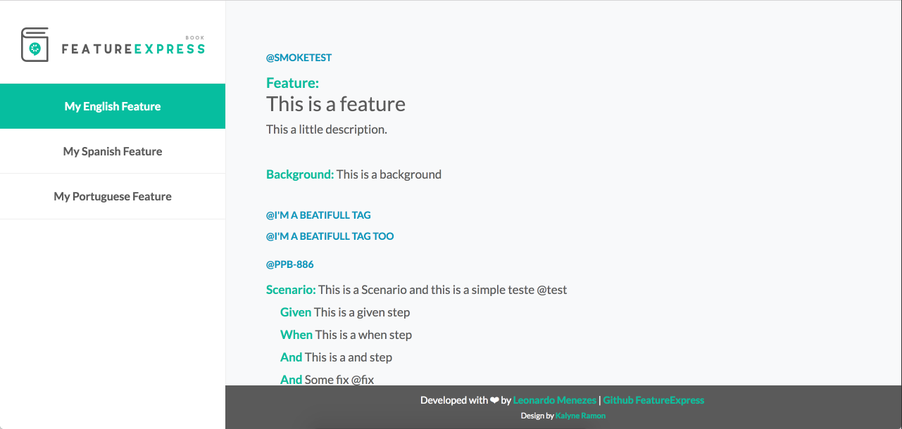

# Feature-Express

Feature-Express is simple way to expose your features in a beatifull html.

[](https://circleci.com/gh/menezes-ssz/feature-express)
[](https://www.npmjs.com/package/feature-express)

## View Sample



# Usage

## To install

```
$ npm install -g feature-express
```

## Running Tips

- To run feature-express you'll need to specify a gherkin language and a port, send it in that order :

```
$ feature-express ./YOUR-FEATURES-FOLDER/ pt 4444
```

- To read all features files from directories and sub directories you'll can do :

```
$ feature-express ./ pt 4444
```

## See your Features on HTML

After running the command, your console will generate a url to see your features **"Feature-Express is running at http://localhost:4444/"**

## Generating a Static Build

- To generate a pre-compiled resources to static servers, just include the argument `build` before the others arguments:

```
$ feature-express build ./ pt 4444
```

After running the command, the folder `.feature-express/build` will be created with all resources.

## Link your jira issues

You can create links to your jira issues with cucumber tags, just add @YOUR-ISSUE-ID

```
@ISSUE-ID
Scenario: This is a Scenario and this is a simple teste @test
    Given This is a given step
    When This is a when step
    Then This is a then step
```

And run feature-express sending all parameters below in that order :

```
 $ feature-express ./features-example/ pt 3000 https://YOUR-JIRA-LINK.atlassian.net/browse/ YOUR-ACRONYM-ON -THE-BOARD
```

For example :

```
 $ feature-express ./features-example/ pt 3000 https://leonardoboard.atlassian.net/browse/ PPB
```

## Running with Docker

### To run feature-express docker image on port 3000 and mapping features folder

```
docker pull menezes-ssz/feature-express:latest
docker run -p 3000:3000 -v ABSOULUTE_PATH_FOR_YOUR_FEATURES_FOLDER:/opt/app/features/ menezes-ssz/feature-express
```

### To change PORT and LANG of feature-expresss

```
docker run -p 3000:3001 -e LANG=en -e PORT=3001 -v ABSOULUTE_PATH_FOR_YOUR_FEATURES_FOLDER:/opt/app/features/ menezes-ssz/feature-express
```

# Language

- Express-Feature only support portuguese (pt), spanish (es) and english (en) language at the moment.
- To add a new laguages options add an object to this enum file **language.js** , and send your pull request.

# NOTE

- **_IMPORTANT : forking staging branch to send your pull request._**

# License

Copyright © 2018 Leonardo Menezes, leonardosmenezes.ssz@gmail.com

Permission is hereby granted, free of charge, to any person obtaining a copy of this software and associated documentation files (the "Software"), to deal in the Software without restriction, including without limitation the rights to use, copy, modify, merge, publish, distribute, sublicense, and/or sell copies of the Software, and to permit persons to whom the Software is furnished to do so, subject to the following conditions:

The above copyright notice and this permission notice shall be included in all copies or substantial portions of the Software.

THE SOFTWARE IS PROVIDED "AS IS", WITHOUT WARRANTY OF ANY KIND, EXPRESS OR IMPLIED, INCLUDING BUT NOT LIMITED TO THE WARRANTIES OF MERCHANTABILITY, FITNESS FOR A PARTICULAR PURPOSE AND NONINFRINGEMENT. IN NO EVENT SHALL THE AUTHORS OR COPYRIGHT HOLDERS BE LIABLE FOR ANY CLAIM, DAMAGES OR OTHER LIABILITY, WHETHER IN AN ACTION OF CONTRACT, TORT OR OTHERWISE, ARISING FROM, OUT OF OR IN CONNECTION WITH THE SOFTWARE OR THE USE OR OTHER DEALINGS IN THE SOFTWARE.
